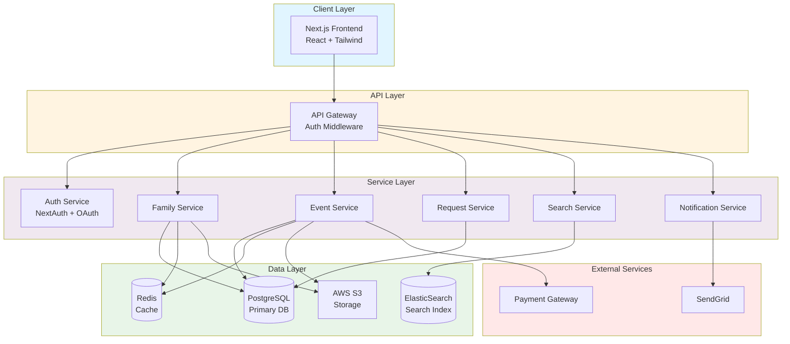
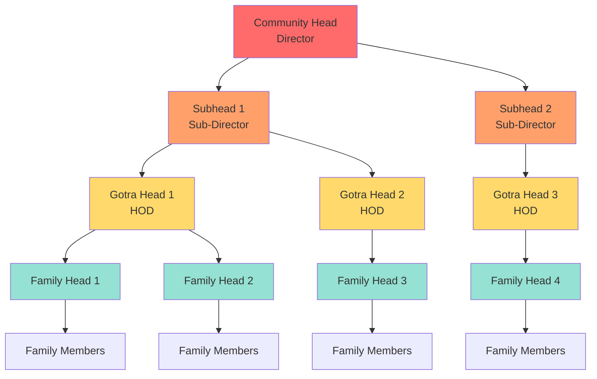
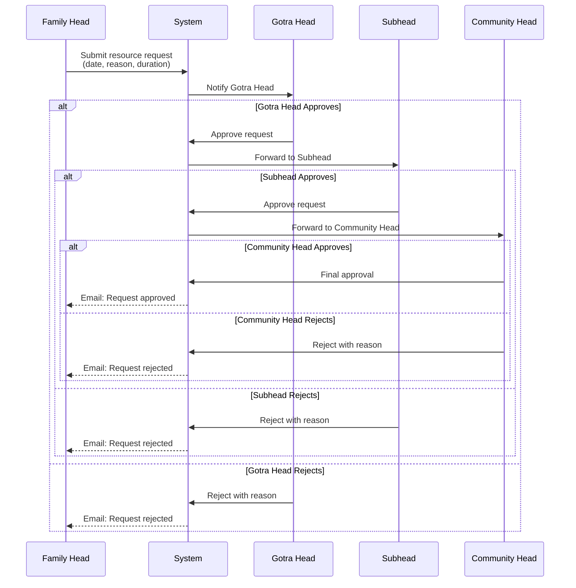
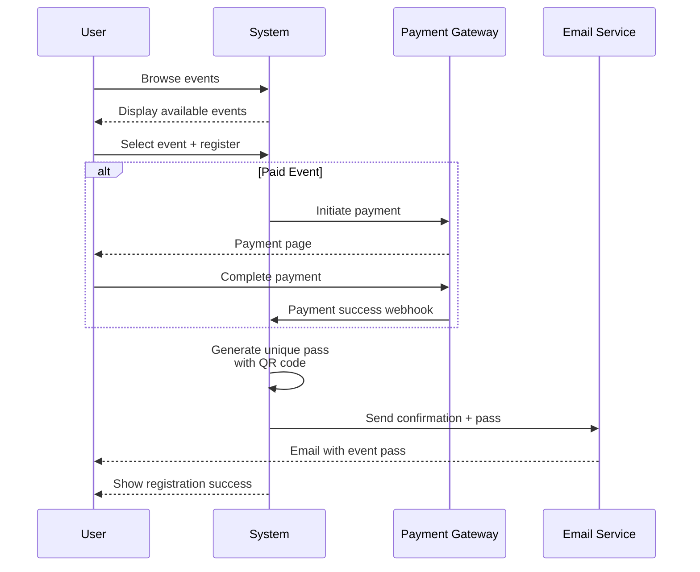
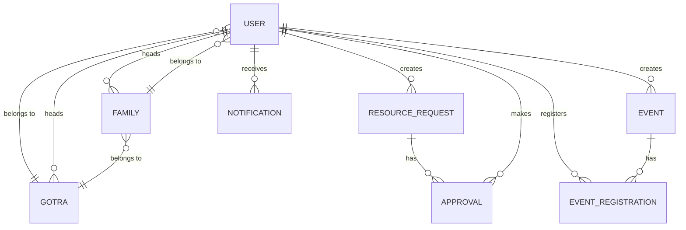
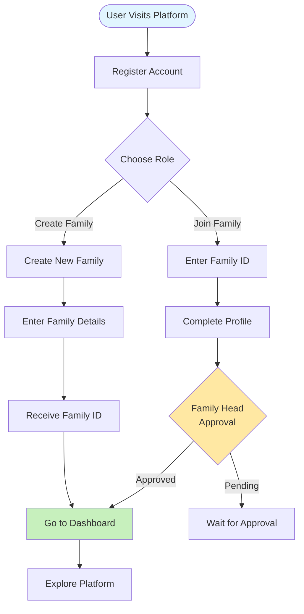
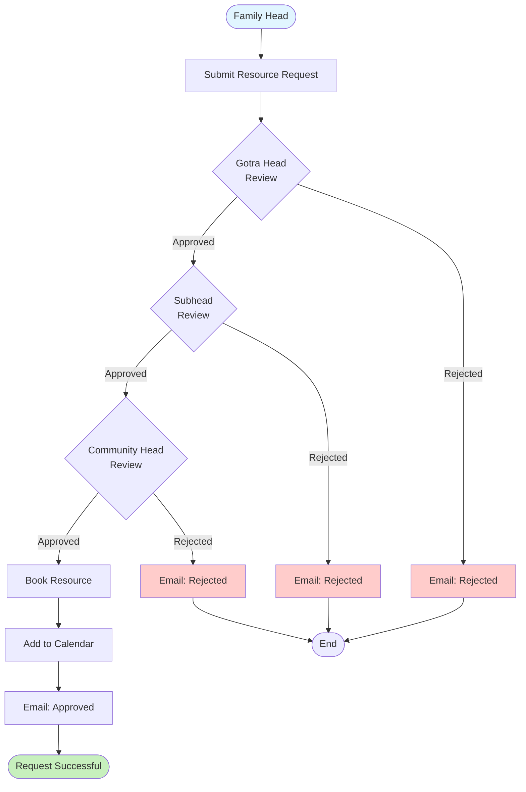
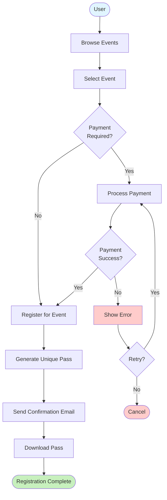
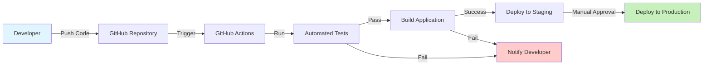

# Community Management Platform

## Table of Contents

1. [System Overview](#system-overview)
2. [Technical Architecture](#technical-architecture)
3. [Requirements](#requirements)
4. [Roles & Hierarchy](#roles--hierarchy)
5. [Core Features](#core-features)
6. [Data Model](#data-model)
7. [API Specification](#api-specification)
8. [User Workflows](#user-workflows)
9. [Security & Compliance](#security--compliance)
10. [Deployment & Operations](#deployment--operations)

---

## 1. System Overview

The Community Management Platform is a comprehensive solution for managing Hindu community operations, including family management, event organization, resource allocation, and member communications. The platform supports hierarchical governance from community directors down to individual family members.

### Key Capabilities

- Family and member lifecycle management
- Hierarchical approval workflows for resource requests
- Event management with online registration and payments
- Advanced search and discovery features
- Location-based community services
- Hindu calendar integration
- Forum and polling mechanisms

---

## 2. Technical Architecture

### 2.2 Architecture Diagram



---

## 3. Requirements

### 3.1 Functional Requirements

#### FR1: User Management

- User registration, login, and logout
- Profile creation and updates
- Password management and recovery
- Role-based access control
- User preferences and settings

#### FR2: Family Management

- Family creation with unique family ID
- Member invitation and onboarding
- Family tree visualization
- Member status tracking (alive/deceased)
- Family profile management

#### FR3: Resource Request Management

- Submit resource requests (halls, facilities)
- Hierarchical approval workflow
- Request tracking and history
- Email notifications for status changes
- Calendar integration for bookings

#### FR4: Event Management (eHEMST)

- Create events with details (date, venue, description)
- Online registration and payment processing
- Unique pass generation with QR codes
- Event reminders and notifications
- Attendance tracking

#### FR5: Search & Discovery

- Search by name, profession, location, gotra
- Advanced filters and sorting
- Profile viewing with privacy controls
- Nearby family discovery

#### FR6: Community Features

- Hindu calendar with important dates
- Discussion forums
- Community polls and voting
- News and announcements

#### FR7: Notifications

- Email notifications
- Push notifications (optional)
- In-app notifications
- Configurable notification preferences

### 3.2 Non-Functional Requirements

#### NFR1: Performance

- Page load time < 3 seconds for critical pages
- API response time < 500ms (95th percentile)
- Support 10,000+ concurrent users
- Database query optimization

#### NFR2: Scalability

- Horizontal scaling capability
- Load balancing across instances
- Efficient caching strategy
- Database replication for read operations

#### NFR3: Reliability

- 99.9% system uptime
- Automated backups (daily)
- Disaster recovery plan
- Error handling and graceful degradation

---

## 4. Roles & Hierarchy



### Role Permissions

| Role               | Permissions                                                                              |
| ------------------ | ---------------------------------------------------------------------------------------- |
| **Community Head** | Full system access, approve all requests, manage all events, view all data               |
| **Subhead**        | Manage assigned gotras, approve gotra-level requests, create and manage community events |
| **Gotra Head**     | Manage families in gotra, approve family requests, create and manage gotra events        |
| **Family Head**    | Manage family members, submit resource requests, register family for events              |
| **Family Member**  | View family info, register for events, participate in forums                             |

---

## 5. Core Features

### 5.1 Family Management

**Family Creation Flow:**

1. User registers and selects "Create Family" option
2. System generates unique family ID
3. Family Head enters family details (name, address, gotra)
4. Family Head receives family ID for sharing

**Member Joining Flow:**

1. Member receives family ID from Family Head
2. Member registers and enters family ID
3. Member completes profile (name, DOB, profession, location)
4. Family Head receives notification and approves member
5. Member gains access to family dashboard

**Member Invite & Approval (detailed)**

- When a user signs up and supplies a `familyId` (or unique family code), the system will create a pending `MemberInvite` record rather than immediately creating a `FamilyMember` entry.
- The `MemberInvite` stores: target `familyId`, `inviteEmail` (or invitedUserId when the user exists), `status` (PENDING/APPROVED/REJECTED), optional `token`, `createdAt`, `expiresAt`, and review metadata (`reviewedBy`, `reviewedAt`, `remarks`).
- The Family Head (or authorized approver) is notified and can view pending invites on a dedicated invites UI. They can Approve or Reject each invite.
- On Approve: the backend creates the `FamilyMember` record (role MEMBER by default), sets the invite `status` to APPROVED, records `reviewedBy`/`reviewedAt`, and sends a notification to the new member.
- On Reject: the invite `status` becomes REJECTED and the requester is notified with any optional remarks.

Why this approach:

- Prevents unauthorized auto-joins and gives Family Heads control.
- Keeps membership history clean (invites separate from accepted FamilyMember rows).
- Supports invite-by-email scenarios (invite pre-registered or external emails).

API (examples):

- POST /api/signup/member — creates User and MemberInvite (status=PENDING) when `familyId` supplied.
- GET /api/families/:id/invites — family-head only: list pending invites.
- PATCH /api/families/:id/invites/:inviteId/approve — approve invite → create FamilyMember.
- PATCH /api/families/:id/invites/:inviteId/reject — reject invite.

**Features:**

- View family tree
- Track member status (alive/deceased)
- Update family information
- Export family data
- Privacy controls per member

### 5.2 Resource Request Management

**Request Workflow:**



**Request Fields:**

- Resource type (hall, facility, equipment)
- Date and time needed
- Duration
- Purpose/reason
- Expected attendance
- Additional requirements
- Priority level

### 5.3 Event Management

**Event Creation:**

- Event name and description
- Date, start time, end time
- Venue details
- Registration deadline
- Payment amount (if applicable)
- Maximum capacity
- Event type (public/private/gotra-specific)

**Registration Flow:**



**Pass Generation:**

- Unique QR code for each registration
- Contains encrypted data: user ID, event ID, timestamp
- PDF format for easy download
- Can be scanned at event entrance

### 5.4 Dashboard

**Family Head Dashboard:**

- Family overview (member count, status)
- Pending approvals
- Active resource requests
- Upcoming events
- Recent notifications
- Quick actions (add member, request resource)

**Member Dashboard:**

- Personal profile summary
- Family information
- Nearby families (location-based)
- Hindu calendar
- Upcoming community events
- Notifications

### 5.5 Search Functionality

**Search Criteria:**

- Name
- Profession
- Location (city, state)
- Gotra
- Skills/expertise

**Search Features:**

- Auto-complete suggestions
- Filters and sorting
- Privacy-respecting results
- Save search preferences

---

## 6. Data Model

### 6.1 Core Entities

```typescript
// User Entity
User {
  id: UUID
  email: String (unique)
  phone: String (unique)
  password: String (hashed)
  name: String
  dateOfBirth: Date
  gender: Enum
  profession: String
  location: Location
  role: Enum (COMMUNITY_HEAD, SUBHEAD, GOTRA_HEAD, FAMILY_HEAD, MEMBER)
  familyId: UUID (FK)
  gotraId: UUID (FK)
  status: Enum (ACTIVE, DECEASED, INACTIVE)
  profileImage: String (S3 URL)
  preferences: JSON
  createdAt: Timestamp
  updatedAt: Timestamp
}

// Family Entity
Family {
  id: UUID
  name: String
  familyId: String (unique, readable)
  headId: UUID (FK to User)
  gotraId: UUID (FK)
  address: Address
  memberCount: Integer
  status: Enum (ACTIVE, INACTIVE)
  createdAt: Timestamp
  updatedAt: Timestamp
}

// Gotra Entity
Gotra {
  id: UUID
  name: String
  headId: UUID (FK to User)
  subheadId: UUID (FK to User)
  familyCount: Integer
  description: Text
  createdAt: Timestamp
}

// ResourceRequest Entity
ResourceRequest {
  id: UUID
  requestedBy: UUID (FK to User)
  familyId: UUID (FK)
  resourceType: Enum (HALL, FACILITY, EQUIPMENT)
  purpose: Text
  startDate: Timestamp
  endDate: Timestamp
  expectedAttendance: Integer
  additionalRequirements: Text
  status: Enum (PENDING, APPROVED, REJECTED, CANCELLED)
  priority: Enum (LOW, MEDIUM, HIGH)
  approvalHistory: Array<Approval>
  currentApprover: UUID (FK to User)
  createdAt: Timestamp
  updatedAt: Timestamp
}

// Approval Entity
Approval {
  id: UUID
  requestId: UUID (FK)
  approverId: UUID (FK to User)
  approverRole: Enum
  status: Enum (APPROVED, REJECTED)
  comments: Text
  timestamp: Timestamp
}

// Event Entity
Event {
  id: UUID
  name: String
  description: Text
  createdBy: UUID (FK to User)
  eventType: Enum (COMMUNITY, GOTRA, FAMILY, PUBLIC)
  scope: Enum (ALL, GOTRA_SPECIFIC, FAMILY_SPECIFIC)
  scopeId: UUID (gotraId or familyId)
  startDate: Timestamp
  endDate: Timestamp
  venue: String
  address: Address
  registrationDeadline: Timestamp
  maxCapacity: Integer
  currentRegistrations: Integer
  paymentRequired: Boolean
  paymentAmount: Decimal
  passTemplate: String (S3 URL)
  status: Enum (DRAFT, PUBLISHED, ONGOING, COMPLETED, CANCELLED)
  createdAt: Timestamp
  updatedAt: Timestamp
}

// EventRegistration Entity
EventRegistration {
  id: UUID
  eventId: UUID (FK)
  userId: UUID (FK)
  familyId: UUID (FK)
  registrationDate: Timestamp
  paymentStatus: Enum (PENDING, COMPLETED, FAILED, REFUNDED)
  paymentId: String
  passId: String (unique)
  passQRCode: String (S3 URL)
  attendanceStatus: Enum (REGISTERED, ATTENDED, NO_SHOW)
  createdAt: Timestamp
}

// Notification Entity
Notification {
  id: UUID
  userId: UUID (FK)
  type: Enum (REQUEST_UPDATE, EVENT_REMINDER, FAMILY_UPDATE, SYSTEM)
  title: String
  message: Text
  relatedEntityType: String
  relatedEntityId: UUID
  isRead: Boolean
  createdAt: Timestamp
}
```

### 6.2 Relationships



---

## 7. API Specification

### 7.1 Authentication APIs

```
POST /api/auth/register
Body: { email, password, name, phone, role }
Response: { user, token }

POST /api/auth/login
Body: { email, password }
Response: { user, token }

POST /api/auth/logout
Headers: { Authorization: Bearer <token> }
Response: { success: true }

POST /api/auth/forgot-password
Body: { email }
Response: { message }

POST /api/auth/reset-password
Body: { token, newPassword }
Response: { success: true }

GET /api/auth/me
Headers: { Authorization: Bearer <token> }
Response: { user }
```

### 7.2 Family Management APIs

```
POST /api/families
Headers: { Authorization }
Body: { name, gotraId, address }
Response: { family }

POST /api/families/:familyId/join
Headers: { Authorization }
Body: { userId, personalInfo }
Response: { membership }

GET /api/families/:id
Headers: { Authorization }
Response: { family, members }

PATCH /api/families/:id
Headers: { Authorization }
Body: { updates }
Response: { family }

GET /api/families/:id/members
Headers: { Authorization }
Query: { status: 'alive' | 'deceased' | 'all' }
Response: { members[] }

DELETE /api/families/:familyId/members/:memberId
Headers: { Authorization }
Response: { success: true }
```

### 7.3 Resource Request APIs

```
POST /api/resource-requests
Headers: { Authorization }
Body: { resourceType, purpose, startDate, endDate, ... }
Response: { request }

GET /api/resource-requests
Headers: { Authorization }
Query: { status, startDate, endDate, page, limit }
Response: { requests[], total, page }

GET /api/resource-requests/:id
Headers: { Authorization }
Response: { request, approvalHistory }

PATCH /api/resource-requests/:id/approve
Headers: { Authorization }
Body: { status: 'approved' | 'rejected', comments }
Response: { request }

DELETE /api/resource-requests/:id
Headers: { Authorization }
Response: { success: true }
```

### 7.4 Event Management APIs

```
POST /api/events
Headers: { Authorization }
Body: { name, description, startDate, venue, ... }
Response: { event }

GET /api/events
Headers: { Authorization }
Query: { type, status, startDate, endDate, page, limit }
Response: { events[], total }

GET /api/events/:id
Headers: { Authorization }
Response: { event, registrationCount }

POST /api/events/:id/register
Headers: { Authorization }
Body: { paymentMethod }
Response: { registration, passUrl }

GET /api/events/:id/registrations
Headers: { Authorization }
Query: { page, limit }
Response: { registrations[] }

PATCH /api/events/:id
Headers: { Authorization }
Body: { updates }
Response: { event }

DELETE /api/events/:id
Headers: { Authorization }
Response: { success: true }
```

### 7.5 Search APIs

```
GET /api/search/users
Headers: { Authorization }
Query: { q, profession, location, gotra, page, limit }
Response: { users[], total }

GET /api/search/families
Headers: { Authorization }
Query: { q, location, gotra, page, limit }
Response: { families[], total }
```

### 7.6 Notification APIs

```
GET /api/notifications
Headers: { Authorization }
Query: { isRead, type, page, limit }
Response: { notifications[], unreadCount }

PATCH /api/notifications/:id/read
Headers: { Authorization }
Response: { notification }

PATCH /api/notifications/mark-all-read
Headers: { Authorization }
Response: { success: true }
```

---

## 8. User Workflows

### 8.1 New User Onboarding



### 8.2 Resource Request Workflow



### 8.3 Event Registration Workflow



---

## 9. Security & Compliance

### 9.1 Security Measures

**Authentication:**

- JWT tokens with expiration (15 min access, 7 day refresh)
- Secure password hashing (bcrypt, salt rounds: 10)
- Password complexity requirements
- Account lockout after failed attempts

**Authorization:**

- Role-based access control (RBAC)
- Middleware authorization checks
- Resource-level permissions
- Audit logging for sensitive operations

**Data Protection:**

- HTTPS/TLS 1.3 for all communications
- Encryption at rest (AES-256)
- Sensitive data masking in logs
- PII data handling compliance

**API Security:**

- Rate limiting (100 req/min per user)
- CORS configuration
- CSRF token validation
- Input validation and sanitization
- SQL injection prevention (Prisma ORM)
- XSS protection (Content Security Policy)

### 9.2 Privacy Controls

**User Privacy:**

- Granular privacy settings per user
- Hide sensitive information (phone, address)
- Control profile visibility
- Data export capability
- Account deletion option

**Family Privacy:**

- Family Head controls member visibility
- Deceased member data handling
- Privacy inheritance rules

### 9.3 Compliance

- GDPR compliance (if applicable)
- Data retention policies
- Regular security audits
- Penetration testing
- Incident response plan

---

## 10. Deployment & Operations

### 10.1 Deployment Architecture

**Production Environment:**

- AWS Cloud Platform
- Multi-AZ deployment for high availability
- Load balancer (AWS ALB)
- Auto-scaling groups
- CloudFront CDN for static assets

**Database:**

- PostgreSQL RDS (Multi-AZ)
- Read replicas for scaling
- Automated backups (daily)
- Point-in-time recovery

**Caching:**

- Redis ElastiCache (cluster mode)
- Session storage
- Query result caching

### 10.2 CI/CD Pipeline



**Pipeline Steps:**

1. Code commit to GitHub
2. Trigger GitHub Actions workflow
3. Run linting and code quality checks
4. Execute unit tests
5. Execute integration tests
6. Build Docker images
7. Push to ECR (Elastic Container Registry)
8. Deploy to staging environment
9. Run smoke tests
10. Manual approval gate
11. Deploy to production
12. Health checks and monitoring

### 10.3 Monitoring & Alerting

**Metrics Tracked:**

- API response times
- Error rates
- Database query performance
- Cache hit rates
- Server resource utilization
- User activity metrics

**Alerting Rules:**

- API error rate > 5%
- Response time > 2 seconds
- Database connection pool exhaustion
- Disk space < 20%
- Memory utilization > 80%

**Tools:**

- Prometheus for metrics collection
- Grafana for visualization
- CloudWatch for AWS resources
- Sentry for error tracking

### 10.4 Backup & Recovery

**Backup Strategy:**

- Database: Automated daily backups, 30-day retention
- User uploads: S3 versioning enabled
- Configuration: Version controlled in Git

**Disaster Recovery:**

- RTO (Recovery Time Objective): 4 hours
- RPO (Recovery Point Objective): 1 hour
- Cross-region backup replication
- Regular DR drills (quarterly)

---

## Appendix

### A. Glossary

- **Gotra**: Ancestral lineage group in Hindu community
- **eHEMST**: Electronic Hindustan Events Management System and Tracking
- **RBAC**: Role-Based Access Control
- **JWT**: JSON Web Token
- **SSR**: Server-Side Rendering
- **SSG**: Static Site Generation

---

**Document Version:** 1.0  
**Last Updated:** October 2025
