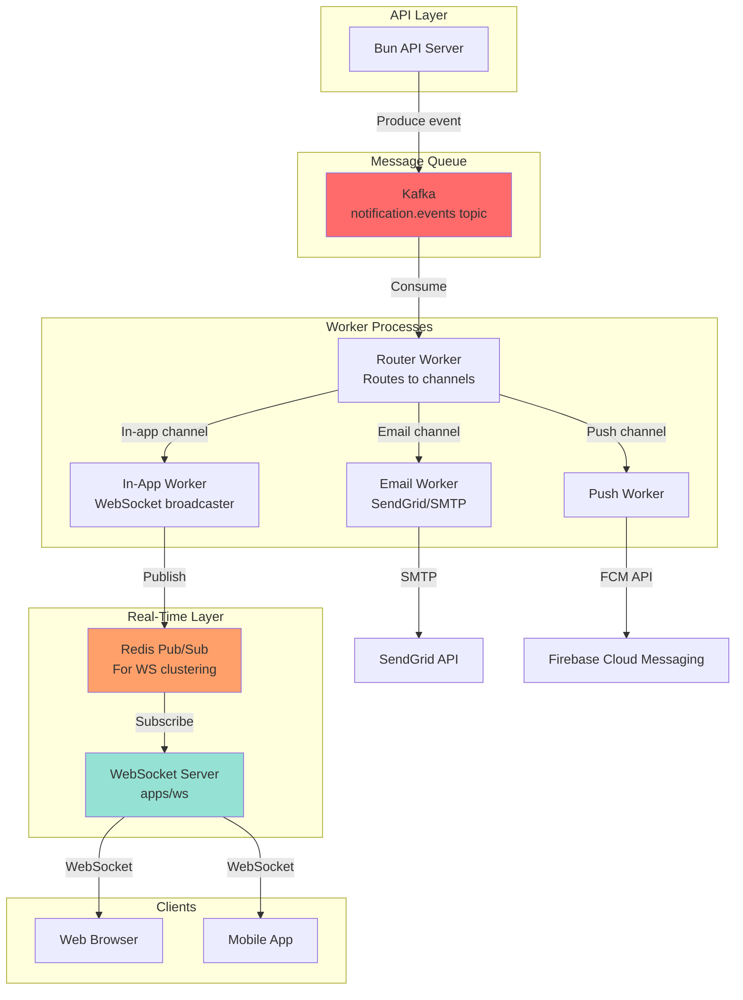

# Notification System

Scalable async notification delivery using Redis Streams with priority-based queues.
Use a pre defined template
A production-grade, event-driven notification system using Kafka for pub/sub messaging, supporting multiple delivery channels (in-app, email, push, SMS).

## Architecture

```
┌─────────────────────────────────────────────────────────────┐
│                    API Request                              │
└─────────────────────────────────────────────────────────────┘
                             │
                             ▼
┌─────────────────────────────────────────────────────────────┐
│  1. Save IN_APP notification to DB (blocking)               │
│  2. Enqueue EMAIL/PUSH to Redis Stream (non-blocking)       │
└─────────────────────────────────────────────────────────────┘
                             │
        ┌────────────────────┼────────────────────┐
        ▼                    ▼                    ▼
   CRITICAL QUEUE      IMPORTANT QUEUE      BULK QUEUE
   (0-5 min SLA)       (5-30 min SLA)       (1-24h SLA)
        │                    │                    │
        ▼                    ▼                    ▼
   [Worker 1]          [Worker N]           [Worker M]
   Send EMAIL/PUSH     Send EMAIL/PUSH      Send EMAIL/PUSH
        │                    │                    │
        └────────────────────┼────────────────────┘
                             │
                             ▼
                    Log success/failure
                  Retry on failure (backoff)
                    Update delivery status
```

## Priority Queues

- **critical**: Status updates (0-5 min SLA) → exclusive worker
- **important**: Event approvals, resource requests (5-30 min SLA) → 2-3 workers
- **bulk**: Event registrations, generic notifications (1-24h SLA) → 1-2 workers

## Setup

### 1. Start Redis

```bash
docker-compose up -d redis
```

Or install locally:

```bash
brew install redis  # macOS
apt install redis-server  # Ubuntu
```

### 2. Set Environment Variables

```bash
# .env
REDIS_URL=redis://localhost:6379
SMTP_HOST=smtp.gmail.com
SMTP_PORT=587
SMTP_SECURE=false
SMTP_USER=your-email@gmail.com
SMTP_PASS=your-app-password
SMTP_FROM=noreply@modheshwari.com
```

### 3. Install Dependencies

```bash
cd /workspaces/modheshwari
bun install
```

### 4. Run Workers

Each worker process handles one priority queue:

```bash
# Terminal 1: Critical queue (highest priority)
bun run --cwd apps/be worker:critical

# Terminal 2: Important queue
bun run --cwd apps/be worker:important

# Terminal 3: Bulk queue
bun run --cwd apps/be worker:bulk
```

Or use PM2 for production:

```bash
pm2 start apps/be/workers/notifications.ts --name "notifications:critical" -- critical
pm2 start apps/be/workers/notifications.ts --name "notifications:important" -- important
pm2 start apps/be/workers/notifications.ts --name "notifications:bulk" -- bulk
```

Workers Logs:
- `Message received`
- `Email sent`
- `Push notification sent`
- `Success`
- `Failure`


### 5. Start Backend & Frontend

```bash
# Backend
bun run --cwd apps/be dev

# Frontend (separate terminal)
bun run --cwd apps/web dev
```

## Usage

### Send Notification via API

```bash
curl -X POST http://localhost:3001/api/notifications \
  -H "Authorization: Bearer <JWT_TOKEN>" \
  -H "Content-Type: application/json" \
  -d '{
    "message": "Your event was approved!",
    "type": "EVENT_APPROVAL",
    "channel": "EMAIL",
    "targetRole": "FAMILY_HEAD"
  }'
```

POST /api/notifications

Broadcast notification (requires admin role)

**Request:**

```json
{
  "message": "Important community update",
  "type": "ANNOUNCEMENT",
  "channels": ["IN_APP", "EMAIL", "PUSH"],
  "subject": "Community Update",
  "targetRole": "MEMBER",
  "priority": "high"
}
```

**Response:**

```json
{
  "success": true,
  "data": {
    "eventId": "notif_1234567890_abc123",
    "recipientCount": 150,
    "channels": ["IN_APP", "EMAIL", "PUSH"]
  },
  "message": "Notifications queued for delivery"
}
```

### Channels

- **IN_APP**: Stored in DB, shown in notification bell (always synchronous)
- **EMAIL**: Sent via SMTP (queued, async)
- **PUSH**: Sent via FCM/OneSignal (placeholder, async)

### Types

- `GENERIC`: General announcements
- `EVENT_APPROVAL`: Event approval status
- `EVENT_REGISTRATION`: Event registration confirmation
- `RESOURCE_REQUEST`: Resource request status
- `PAYMENT_RECEIPT`: Payment confirmation
- `STATUS_UPDATE_REQUEST`: Status change notification

## Monitoring

### Check Queue Status

```bash
redis-cli
> XINFO STREAM notifications:critical
> XINFO STREAM notifications:important
> XINFO STREAM notifications:bulk
> XLEN notifications:critical  # Message count
```

### View Consumer Groups

```bash
> XINFO GROUPS notifications:critical
```

### Manual Retry (Dead Letter Queue)

```bash
# Peek at failed messages
> XRANGE notifications:critical 0 -1

# Re-enqueue if needed
> XADD notifications:important "*" payload "<json>"
```

## Graceful Shutdown

Workers respond to `SIGTERM`:

```bash
kill -TERM <WORKER_PID>
```

Workers will:

1. Stop accepting new messages
2. Finish processing current batch
3. Exit cleanly

## Performance Tuning

### Consumer Count per Queue

- **Critical**: 1-2 workers (exclusive, high throughput)
- **Important**: 2-4 workers (balanced)
- **Bulk**: 1-2 workers (low priority)

### Batch Sizes

- **Block timeout**: 5 seconds (balance latency vs CPU)
- **Messages per read**: 10-50 (tune based on message size)

### Retry Strategy

- **Backoff**: 1s → 5s → 30s → 5m (exponential)
- **Max retries**: 3 (before DLQ)
- **DLQ retention**: 7 days

## Troubleshooting

### Workers not picking up messages

1. Check Redis connection: `redis-cli ping`
2. Verify consumer group exists: `XINFO GROUPS notifications:important`
3. Check worker logs for errors

### Messages stuck in Dead Letter Queue

1. Review error logs: `bun run --cwd apps/be worker:important 2>&1 | tail -100`
2. Fix underlying issue (e.g., invalid SMTP credentials)
3. Re-enqueue manually

### High latency

1. Check worker CPU/memory: `top`
2. Increase worker count for that priority
3. Reduce message payload size
4. Check email provider rate limits

## Future Enhancements

- [ ] Push notification support (Firebase Cloud Messaging)
- [ ] SMS delivery (Twilio)
- [ ] Digest mode (batch hourly/daily)
- [ ] Email template localization
- [ ] User preference management
- [ ] Webhook delivery
- [ ] Message scheduling
- [ ] Analytics dashboard

- use kafka, and pub-sub architecture

---

Modheswari me eesa kro
Ki when admins put up for a notification, then they need to choose whether it will go to whom
Cause agar mene gotraHead liya say
Ab usne bola ki bhai meri family yaha aao
To ye to sabko uske gotra me chla jyega na

---




## Features

- **Multi-channel delivery**: In-app, email, push notifications, SMS
- **Event-driven architecture**: Kafka for reliable message delivery
- **Horizontal scalability**: Run multiple consumer instances
- **User preferences**: Respect user notification settings
- **Rich templates**: HTML emails, customizable push notifications
- **Failure handling**: Invalid token cleanup, retry logic
- **Priority levels**: Low, normal, high, urgent
- **Role-based targeting**: Send to specific user groups